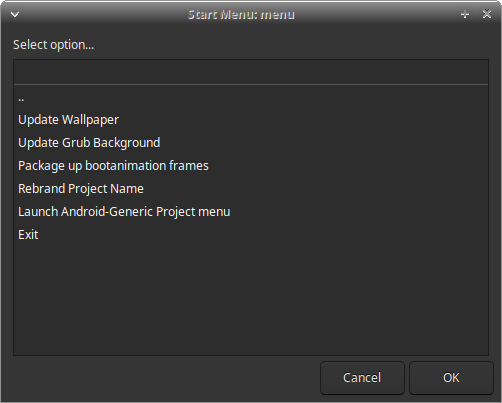

# Bass vendor customization layer

This repo includes the vendor customization layer for Bass (Broad Apparatus Support System).
This is used to help with rebranding, build configuration, customization and app changes for Bliss OS based builds, targeting managed, educational devices, kiosks and single application use cases. 

Some preparation is needed to include apps into the builds. 

## Features:

 - Menu driven interface for updating assets and branding:
	
 - Generates default wallpaper overlays
 - Generates branded bootanimation based on a single loop of frames
 - Generates branded grub background
 - Supports various navigation & UI switches
 - Supports various use-case launcher options (requires recent changes to vendor/agp-apps)
 - Automatically updates Grub menus and other build configs for launcher and mode options (requires recent changes to vendor/agp-apps)
 - Supports applying separate patchsets on-top of Bliss OS or Bliss OS Go source updates
 - More to come (let us know what you would like to see)
 
##### Options Usage:
	 
	$ . build/envsetup.sh && build-x86 --help
	
	Usage: build-x86.sh [options]
	Options:
	-h, --help             Display this help dialog
	-c, --clean            Clean the project
	-d, --dirty            Run in dirty mode
	-t, --title <title>    Set the release title
	-b, --blissbuildvariant <variant>   Set the Bliss build variant
	-i, --isgo             Enable isgo version
	-v, --specialvariant <variant>      Set the special variant
	--production           Disable Test Build watermark

	Launcher Options:
	-s, --smartdock        Enable smartdock
	-k, --kiosk            Enable kiosk launcher
	--restrictedlauncher   Enable restricted launcher
	--garliclauncher       Enable garlic launcher
	--gamemodelauncher     Enable game mode launcher
	--crosslauncher        Enable cross launcher

	Navigation Options:
	-t, --tabletnav        Enable tablet navigation
	--taskbarnav           Enable taskbar navigation
	--gesturenavigation    Enable gesture navigation

	Package Options:
	--noksu                Disable KernelSU
	-f, --fossapps         Enable fossapps
	-e, --supervanilla     Enable supervanilla
	-m, --minimal          Enable minimal packages
	-r, --removeusertools  Enable removeusertools
	--viabrowser           Enable viabrowser
	-w, --wiz              Enable Bliss setupwizard
	--ethernetmanager      Enable EthernetManager
	--powermanager         Enable power manager

	Other Options:
	-a, --atom             Enable Intel Atom
	-l, --lockdown         Enable secure lockdown build
	--clearhotseat         Enable clear hotseat favorites
	-m, --manifest         Generate manifest

## AOSP Build Instructions:

To include the branding changes into your device specific builds. Please clone 
this repo into vendor/branding:

	$ git clone https://github.com/Bliss-Bass/platform_vendor_bass vendor/bass

#### Step 1:
	
Add this inherit to your device tree:

	# vendor/bass
	$(call inherit-product-if-exists, vendor/bass/branding.mk)

#### Step 2:

From here we can cd back to our project directory and run:

	$ . build/envsetup.sh

#### Step 3: 

Prepare your branding changes:

##### Automatically:

We can use the menu driven interface to apply branding changes manually. To do so, just access the menu: 

	$ . build/envsetup.sh && launch_menu

##### Manually:

 - default wallpaper: Place default_wallpaper.png in branding/wallpaper/ replacing the file there already
 - bootanimation: Place a bootanimation.tar of your bootanimation frames in branding/bootanimation/
 - grub: Place your custom grub backgrounds in branding/grub

When lunch is triggered, it will copy your branding files over to the proper overlays or package them in the build phase.

#### Step 4:

After patches apply successfully, you can use the following command to start a clean build:

	$ build-x86 --clean 

When compile is complete, you can then find your .iso file in the iso/ folder 

## Overlays included:

We include a few of the overlays specific to branding in this project. 

 - Wallpapers
 - Bootanimation
 - Advanced power-menu overrides
 - virtual keyboard overrides
 - BlissUpdater
 - Blissify Settings
 - SetupWizard
 - etc.

### Default Collections

The Bass demo builds are put together by using the various command options together. Here are a few examples to help in understanding:

**BassDesktop**: Desktop mode demo of Bass featuring SmartDock

	. build/envsetup.sh && build-x86 --dirty --title "BassDesktop" --blissbuildvariant foss --smartdock --wiz --ethernetmanager --fossapps --noksu --clearhotseat
	
**BassRest**: Restricted mode demo of Bass featuring Bliss Restricted Launcher
	
	. build/envsetup.sh && build-x86 --clean --title "BassRest" --blissbuildvariant foss --restrictedlauncher --ethernetmanager --fossapps --noksu --gesturenavigation
	
**BassSignage**: Ad/Signage version of Bass featuring GarlicLauncher
	
	. build/envsetup.sh && build-x86 --clean --title "BassSignage" --blissbuildvariant vanilla --isgo --garliclauncher --ethernetmanager --noksu --taskbarnav --gesturenavigation --clearhotseat
	
**BassKiosk**: Android Go based Kiosk version of Bass featuring Bliss Kiosk Launcher
	
	. build/envsetup.sh && build-x86 --clean --title "BassKiosk" --blissbuildvariant foss --isgo --kiosk --ethernetmanager --fossapps --noksu --gesturenavigation --clearhotseat
	
**BassCGame**: Gaming focused demo of Bass featuring CrossLauncher
	
	. build/envsetup.sh && build-x86 --clean --title "BassCGame" --blissbuildvariant foss --crosslauncher --ethernetmanager --fossapps --noksu --tabletnav --taskbarnav --clearhotseat
	

### Patching

(**Patching is not needed when building Bass from source. All required patches are already applied to the Bass manifest. Patching is only required when creating a new Bass based source from scratch**)

#### How to use the patching system:

To apply the changes for Bliss Bass, we need to update the base with our changes for the project. To do that, we first 
need to know if we are using Bliss-OS or Bliss-OS Go (currently only 15.x versions are supported through these patchsets). 

*ATTN VENDORS:* To add your changes to this patching system, you will first need to know your base OS, and then run off your changes as .patch files:

	$ cd bootable/newinstaller
 	$ git format-patch -1

Then copy that .patch file to patches/patchsets(-go)/bootable/newinstaller/, and then cd back to your project folder and continue below

*Bliss Bass:*

	$ check_patchsets
	
*Bliss Bass Go:*

	$  check_patchsets go
	
This will apply all the required changes for the project variant
(On new base updates, there is a chance of patchsets not applying cleanly. Some work will be 
needed to resolve patch conflicts before continuing to the next step)

**NOTE** New patchsets can also be created and saved to patches/patchsets-<your_patchset_name>, then applied using:

	$ check_patchsets <your_patchset_name>  

